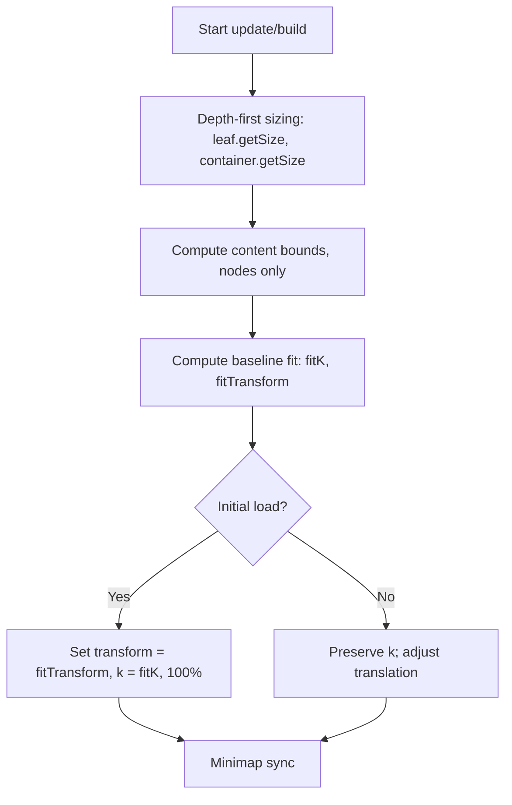
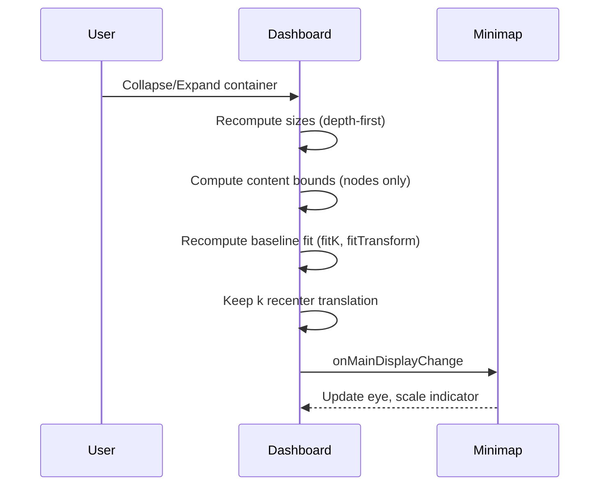

### Automatic Zoom and Minimap Behavior

Scope
- This document is an implementation-ready spec for zooming and positioning in Flowdash. It defines contracts, algorithms, defaults, and acceptance criteria so the zoom/minimap system can be reimplemented or refactored safely.

Goals
- Maintain a stable user experience (preserve perceived zoom when possible).
- Recompute fit baselines when layout changes so scale indicators and reset behave correctly.
- Keep the minimap synchronized with the main viewport at all times.

### Definitions
- **Transform (k, x, y)**: Current main zoom scale `k` and translation `(x, y)` applied to `dashboard.main.container` via the zoom behavior.
- **Baseline fit (fitK, fitTransform)**: Scale and transform to fit all current content bounds, used by the minimap scale indicator and zoom reset. By definition, this baseline corresponds to 100% zoom.
- **Content bounds**: Bounding box of all visible nodes in the main container. Edges (including their labels) are ignored for the first-pass bounds used for baseline fit, zoom, and positioning.
- **Minimum target bbox (optional)**: A minimum on-screen size clamp used only for zoom-to-target actions to avoid over-zooming tiny nodes. Default: 24×24 px. Set to 0 to disable.

### Zoom scale k (what it means)
- `k` is the scale factor applied by the zoom transform. Screen coordinates are computed as `screen = k * world + translation`.
- `fitK` is the scale that makes current content bounds exactly fit the viewport: `fitK = min(viewportWidth / contentWidth, viewportHeight / contentHeight)`.
- 100% zoom is defined as `k === fitK`. Zooming in increases `k` (> fitK), zooming out decreases `k` (< fitK).
- Layout-only changes preserve `k` and adjust translation so the visible region stays stable.

### Architecture and contracts
- Core components: base nodes (`nodeBase.js`, `nodeBaseContainer.js`), zoom behavior (applies `(k,x,y)`), minimap (content clone/simplification + eye/indicator), and the zone system for container interiors.
- Inputs: node tree, node states (collapsed/expanded), viewport size, settings.
- Outputs: per-node sizes from `getSize()`, overall content bounds, `(fitK, fitTransform)`, current `transform`.

Node model and sizing contract
- Sizing and positioning originate in the base classes `nodeBase.js` and `nodeBaseContainer.js`. Derived node types may customize visuals, but zooming/positioning calculations must rely on these base contracts only.
- `nodeBase.getSize()` returns the full visual size for the node in its current state, including margins, headers, gutters, and all labels. Any decoration that is visible must be accounted for.
- `nodeBaseContainer.getSize()` must always return a valid size regardless of whether the container is collapsed or expanded. Inner edges are included within the container’s inner content box (they must not extend outside the returned size). When collapsed or when no live DOM bbox exists, return the collapsed footprint supplied by the node data, honoring minimum width/height constraints.
- Derived classes must not bypass the base sizing contract for zoom/layout. They may augment rendering, but for bounds, minimap, and zoom-to-target computations the system uses `getSize()` from the base classes.
- Minimum sizes: Nodes may specify `minWidth`/`minHeight` (and collapsed minimums). `getSize()` must enforce these so layout and content bounds remain stable.
- Collapsed size source of truth: Collapsed width/height is computed in code (see `BaseContainerNode.collapse()` and header/zone metrics), not from static CSS. However, CSS (e.g., font-size) affects measured header text/control sizes which feed into these computed values.

### Layout and build process (depth-first)
When building or updating the dashboard layout, perform a depth-first sizing pass, then compute fit/zoom baselines:
1) Depth-first sizing
  - Compute sizes for leaf nodes first using `nodeBase.getSize()` (data defaults + measured DOM if available).
  - For containers, use `nodeBaseContainer.getSize()` to aggregate children (plus container chrome such as headers, paddings, gutters, lane/column metrics) and to return the correct collapsed/expanded size.
  - Propagate sizes upward until the root node’s size is determined.
2) Compute content bounds
  - From all visible nodes, compute the overall `content bounds`. Use base `getSize()` outputs; ignore edges entirely in this pass.
3) Compute baseline fit
  - From viewport size and content bounds, compute `(fitK, fitTransform)` so the entire flow fits exactly inside the dashboard viewport (either the left/right sides touch or top/bottom touch, without cropping). This baseline is 100% zoom.
4) Initialize or preserve transform
  - On initial load, always set transform to `fitTransform` (100%). On subsequent structural changes, keep `k` constant per R1 and only adjust translation to keep the view stable.

Optional follow-up pass (visual polish only)
- Optionally expand the minimap’s content mask to include edge geometry/labels if they extend beyond node boxes. This does not change `(fitK, fitTransform)`.

### Core invariants and rules
- **R1. Preserve current scale on layout-only changes**: When layout changes (collapse/expand, status-driven changes, window resize), keep `transform.k` constant where feasible and re-center translation so the visible world region remains stable.
- **R2. Recompute baseline fit after content changes**: After any change that affects content bounds (collapse/expand, status cascade, node additions/removals, resize), recompute `fitK`/`fitTransform` from current content bounds so the minimap scale indicator and Zoom Reset reflect the new baseline. The scale indicator shows `percent = (transform.k / fitK) * 100` and Zoom Reset returns to 100%.
- **R3. Minimap stays in lockstep**: Any change to main transform or content bounds must schedule a minimap update: refresh content, update viewBox/masks, update eye viewport, update scale indicator, and re-position cockpit.
- **R4. Avoid recursive updates**: Sync flags prevent main↔minimap feedback loops; minimap uses debounced viewport updates.
- **R5. Do not auto-change user zoom intent**: Never change `k` due to a collapse/expand unless the user explicitly invoked a zoom action (Zoom In/Out/Reset/Zoom to Node/Bounding Box).
 - **R5. Do not auto-change user zoom intent**: Never change `k` due to a collapse/expand unless the user explicitly invoked a zoom action (Zoom In/Out/Reset/Zoom to Node/Bounding Box). Exception: if the user is currently at 100% (i.e., `approximatelyEqual(k, oldFitK)`), snap to the new baseline (`k := newFitK`) so the user remains at 100% after the baseline shifts.
Epsilon for equality checks
- Use a small epsilon when comparing `k` to `fitK` to account for float/animation noise, e.g., `approximatelyEqual(a,b) := |a-b| <= max(1e-6, 0.005 * b)` (≈0.5%).
- **R6. Fit-to-target actions animate via zoom behavior**: Actions that intentionally change zoom (zoom reset, zoom to node, zoom to bbox) must call the zoom behavior so the main and minimap remain synchronized.
- **R7. Ignore edges for baseline fit and transform**: Edges (and edge labels) must not influence content bounds or `fitK/fitTransform`. Edge visibility toggles (e.g., density-based) update visuals/minimap but never change the baseline fit.

### Scale model and “100%” definition
- 100% zoom is defined as the current `Baseline fit`. At 100%, `transform.k === fitK` and the full content just fits the viewport.
- The minimap scale indicator and any UI badges display `round((k / fitK) * 100)%`.
- Initial load starts at 100% (fit). Zoom Reset always returns to 100% of the current baseline. When content changes, the baseline (and therefore what 100% means) may change; we preserve absolute `k` per R1 and update the indicator accordingly.

### User actions

- **A1. Collapse a container (click)**
  - Dashboard:
    - Apply collapse, recompute container size/visibility.
  - If current zoom is 100% (k ≈ oldFitK), snap to the new baseline (`k := newFitK`). Otherwise keep `k` unchanged (R1). Adjust `(x,y)` to maintain the same world center in screen space; avoid sudden jump.
    - Recompute `fitK`/`fitTransform` based on new content bounds (R2).
  - Minimap:
    - Regenerate content (simplified or clone), update viewBox/masks to new content bbox, update eye from current main transform (R3).
    - Update scale indicator based on `transform.k / fitK`.

- **A2. Expand a container (click)**
  - Dashboard: Same as A1; expand, layout children; if at 100% snap to new baseline, else keep `k`; recenter `(x,y)` if necessary; recompute baseline fit.
  - Minimap: Same as A1.

- **A3. Double-click zoom to node or neighborhood**
  - Dashboard:
  - Compute bbox (use Minimum target bbox when only self selected, if enabled) and animate to that bbox via zoom behavior (R6).
    - Update `transform`, then recompute baseline fit (R2) if content bounds changed due to reveal.
  - Minimap:
    - Update viewport eye to match new transform; update scale indicator.

- **A4. Zoom In/Out buttons or wheel/pinch**
  - Dashboard: Update `transform` via zoom behavior; no change to baseline fit unless content bounds change.
  - Minimap: Debounced viewport update; update scale indicator.

- **A5. Zoom Reset**
  - Dashboard: Animate to `fitTransform` (current baseline) via zoom behavior; preserves up-to-date baseline since R2.
  - Minimap: Update viewport eye and scale indicator accordingly.

- **A6. Window resize / fullscreen toggle**
  - Dashboard: Preserve `k` (R1), recompute `(x,y)` to keep world center stable; recompute baseline fit (R2).
  - Minimap: Resize to target pixel size, recompute content scale and eye; update scale indicator and cockpit position.

### State-Driven Changes

- **S1. Status update collapses/expands nodes (toggleCollapseOnStatusChange=true)**
  - Dashboard:
    - Apply status, possibly toggling `collapsed` on affected containers. Avoid zoom changes (R5). Keep `k`, adjust `(x,y)` to keep view stable (R1).
    - When any node visibility/size changes affect bounds, recompute baseline fit (R2).
  - Minimap: Full content update and viewport sync (R3).

- **S2. Bulk status changes (dataset-wide)**
  - Dashboard: Same as S1; process all nodes, then recompute baseline fit once.
  - Minimap: Single aggregated update after layout settles.

### Selection and Neighborhood

- **N1. Single-click select**: No zoom change. Render selection bbox; minimap unchanged except content refresh if needed.
- **N2. Double-click inside active neighborhood bbox**: Zoom to that bbox (R6). Minimap updates eye and indicator.

### Minimap Visibility
- **M1. Hover mode auto-hide**: When not pinned, collapse cockpit when zoomed out to fit-or-below threshold; show cockpit when zoomed in. Keep visible while interacting/hovering.
- **M2. Pinned mode**: Always visible; still updates scale indicator and viewport.

### Edge cases
- **E1. Collapsed nodes without DOM bbox**: Use `nodeBaseContainer.getSize()` or fallback node data width/height for minimap rectangles and content bounds calculations. Collapsed height/width are supplied by the node and must respect minimums.
- **E2. Extremely small targets**: When zooming to a tiny node, you may expand the target to the configured Minimum target bbox to avoid over-zooming; set to 0 to disable if not needed.
- **E3. Duplicate cockpit elements**: Detect and remove duplicates; re-initialize minimap safely on data reloads.

### Edges and visual density
- Inner edges may be hidden when density is high (in the main view and/or minimap) to reduce clutter. This is a visual policy and does not affect layout, content bounds, or baseline fit.
- Recommended triggers:
  - Zoom-level threshold: hide inner edges when `k / fitK < 0.4` (i.e., below 40% of baseline size).
  - Density threshold: hide when edges per screen area exceed 0.001 edges/px² in the current viewport (≈ 1,000 edges on a 1MP viewport). Tune as needed.
  - Per-container cap: hide edges for a container when its visible inner-edge count exceeds 500 while `k / fitK < 0.6`.
- When edge visibility changes, call `dashboard.onMainDisplayChange()` to refresh the minimap; no baseline recompute is necessary.

### Implementation hooks
- After any expand/collapse or status-induced visibility change, call:
  - `dashboard.recomputeBaselineFit()`
  - `dashboard.onMainDisplayChange()` (schedules minimap update) or ensure equivalent update path is invoked.
- For user-initiated zoom actions, use:
  - `zoomIn()`, `zoomOut()`, `zoomReset()`
  - `zoomToNode(node)` / `zoomToBoundingBox(bbox)`

### Practical contract (inputs/outputs)
- Inputs: node tree, node states (collapsed/expanded), viewport size.
- Outputs: per-node sizes from `getSize()`, overall content bounds, `(fitK, fitTransform)`, current `transform`.
- Success criteria: content fully fits at 100%; minimap reflects viewport; zoom reset returns to 100%; no jumps in perceived scale on layout-only changes.

### Algorithms (pseudocode)

Depth-first sizing
```
function depth_first_sizing(root):
  for node in postorder(root):
    if node.isLeaf():
      size = nodeBase.getSize(node)
    else:
      childSizes = [c.size for c in node.children if c.visible]
      size = nodeBaseContainer.getSize(node, childSizes)
    size.width = max(size.width, node.minWidth)
    size.height = max(size.height, node.minHeight)
    node.applySize(size)
    node.cachedBounds = computeNodeBounds(node)
```

Compute baseline fit
```
function compute_fit(contentBounds, viewport):
  contentW = contentBounds.width; contentH = contentBounds.height
  fitK = min(viewport.width / contentW, viewport.height / contentH)
  // center content in viewport
  tx = viewport.cx - fitK * contentBounds.cx
  ty = viewport.cy - fitK * contentBounds.cy
  return { fitK, fitTransform: { k: fitK, x: tx, y: ty } }
```

Apply layout-only change (preserve k)
```
function preserve_k_and_recentre(oldTransform, oldBounds, newBounds, viewport):
  k = oldTransform.k
  // keep same world center on screen (use old center to avoid jumps)
  worldCx = oldBounds.cx; worldCy = oldBounds.cy
  x = viewport.cx - k * worldCx
  y = viewport.cy - k * worldCy
  return { k, x, y }
```

Zoom to target bbox (with minimum target bbox)
```
function zoom_to_bbox(targetBounds, viewport, minBBoxPx = {w:24,h:24}):
  if minBBoxPx and (minBBoxPx.w > 0 and minBBoxPx.h > 0):
    targetBounds = expandToMinScreenSize(targetBounds, minBBoxPx)
  k = min(viewport.width / targetBounds.width, viewport.height / targetBounds.height)
  x = viewport.cx - k * targetBounds.cx
  y = viewport.cy - k * targetBounds.cy
  animateZoom({k,x,y}) via zoom behavior
```

Handle window resize
```
function on_resize(oldTransform, bounds, newViewport):
  // keep k; adjust translation to keep the same world center in view
  k = oldTransform.k
  x = newViewport.cx - k * bounds.cx
  y = newViewport.cy - k * bounds.cy
  return { k, x, y }
```

Incremental recompute (layout-specific impacted region)
```
function request_layout_change(changedNode, layoutEngine, themeVersion):
  // 1) Determine impacted region based on layout specifics (lanes/columns/zones)
  impacted = layoutEngine.computeImpactedSet(changedNode)
  // Always include ancestors up to root to allow containers to resize
  impacted |= ancestorsInclusive(changedNode)

  // 2) Mark dirty
  for n in impacted:
    n.dirty = true

  // 3) Recompute sizes post-order only for dirty nodes
  for n in postorder(root):
    if !n.visible: continue
    if n.dirty or n.themeVersion != themeVersion:
      if n.isLeaf():
        n.size = nodeBase.getSize(n)
      else:
        childSizes = [c.size for c in n.children if c.visible]
        n.size = nodeBaseContainer.getSize(n, childSizes)
      n.size.width = max(n.size.width, n.minWidth)
      n.size.height = max(n.size.height, n.minHeight)
      n.applySize(n.size)
      n.cachedBounds = computeNodeBounds(n)
      n.themeVersion = themeVersion
      n.dirty = false

  // 4) Compute overall content bounds from cached bounds
  contentBounds = union([n.cachedBounds for n in allVisibleNodes(root)])

  // 5) Recompute baseline
  {fitK, fitTransform} = compute_fit(contentBounds, viewport)

  // 6) Preserve k unless user was at 100%
  if approximatelyEqual(oldTransform.k, oldFitK):
    newTransform = fitTransform // stay at 100%
  else:
    newTransform = preserve_k_and_recentre(oldTransform, oldContentBounds, contentBounds, viewport)

  // 7) Apply and refresh
  applyTransform(newTransform) via zoom behavior
  onMainDisplayChange()
```

Cache invalidation
- Long-lived caches are allowed for sizes and bounds. Invalidate by:
  - Marking nodes dirty when data/state changes or when included in the impacted region.
  - Bumping a `themeVersion` token (font-size/theme swap) to force remeasure on next update.
  - Explicit reset on viewport DPI/zoom changes (if applicable).

### Configuration defaults
- Minimum target bbox (zoom-to-target): 24×24 px (set to 0 to disable)
- Edge visibility thresholds:
  - Hide when `k / fitK < 0.4`
  - Hide when edges per screen area > 0.001 edges/px²
  - Per-container cap: hide when inner-edge count > 500 and `k / fitK < 0.6`
- Minimap: debounced viewport updates; update on any transform or content-bounds change

### Acceptance criteria (tests/invariants)
- Initial load sets `transform = fitTransform` (100%); minimap reflects this immediately.
- On collapse/expand, if the user was at 100% before the change, the view remains at 100% after (snap to new baseline). Otherwise `k` stays constant; view recenters smoothly; minimap updates once.
- Zoom Reset returns to the latest computed baseline fit after any structural change.
- Zoom-to-node respects minimum target bbox when enabled; animation occurs through zoom behavior; minimap eye matches.
- Window resize preserves `k`; recenters; recomputes baseline; minimap stays in sync.
- Edges toggling (density-based) never changes `fitK`/`fitTransform`.

## Visual examples (SVG)

### Content bounds ignore edges (baseline fit)
<svg width="560" height="260" viewBox="0 0 560 260" xmlns="http://www.w3.org/2000/svg">
  <defs>
    <style>
      .node { fill:#E3F2FD; stroke:#1976D2; stroke-width:2; }
      .container { fill:#E8F5E9; stroke:#2E7D32; stroke-width:2; }
      .edge { stroke:#9E9E9E; stroke-width:2; fill:none; marker-end:url(#arrow); }
      .edge-ignored { stroke:#EF5350; stroke-dasharray:6 4; }
      .bounds { fill:none; stroke:#43A047; stroke-width:2; stroke-dasharray:8 6; }
      .label { font:12px sans-serif; fill:#333; }
    </style>
    <marker id="arrow" viewBox="0 0 10 10" refX="8" refY="5" markerWidth="6" markerHeight="6" orient="auto-start-reverse">
      <path d="M 0 0 L 10 5 L 0 10 z" fill="#9E9E9E" />
    </marker>
  </defs>
  <!-- Container (for context) -->
  <rect class="container" x="40" y="30" width="300" height="200" rx="8"/>
  <text class="label" x="50" y="48">Container</text>
  <!-- Nodes -->
  <rect class="node" x="70" y="80" width="80" height="50" rx="6"/>
  <text class="label" x="80" y="110">A</text>
  <rect class="node" x="210" y="120" width="100" height="70" rx="6"/>
  <text class="label" x="220" y="160">B</text>
  <!-- Edge that extends outside the container -->
  <path class="edge edge-ignored" d="M150,105 C180,60 420,60 500,40" />
  <text class="label" x="420" y="36">Edge outside (ignored for baseline)</text>
  <!-- Content bounds of nodes only -->
  <rect class="bounds" x="70" y="80" width="240" height="110"/>
  <text class="label" x="75" y="200">Content bounds (nodes only)</text>
</svg>

### Baseline fit and 100% zoom
<svg width="560" height="260" viewBox="0 0 560 260" xmlns="http://www.w3.org/2000/svg">
  <defs>
    <style>
      .viewport { fill:none; stroke:#424242; stroke-width:2; }
      .content { fill:#FFFDE7; stroke:#F9A825; stroke-width:2; }
      .fit { fill:none; stroke:#1E88E5; stroke-width:2; stroke-dasharray:6 4; }
      .label { font:12px sans-serif; fill:#333; }
    </style>
  </defs>
  <!-- Viewport -->
  <rect class="viewport" x="40" y="30" width="480" height="200"/>
  <text class="label" x="44" y="48">Viewport (Wv × Hv)</text>
  <!-- Content bounds -->
  <rect class="content" x="140" y="60" width="280" height="140"/>
  <text class="label" x="145" y="78">Content bounds (Wc × Hc)</text>
  <!-- Fit guides -->
  <line class="fit" x1="140" y1="200" x2="420" y2="200"/>
  <text class="label" x="250" y="218">fitK = min(Wv/Wc, Hv/Hc)</text>
  <text class="label" x="250" y="236">100% zoom ⇔ k = fitK</text>
</svg>

### Minimum target bbox (24×24) for zoom-to-target
<svg width="560" height="200" viewBox="0 0 560 200" xmlns="http://www.w3.org/2000/svg">
  <defs>
    <style>
      .tiny { fill:#FCE4EC; stroke:#AD1457; stroke-width:2; }
      .minbox { fill:none; stroke:#AD1457; stroke-width:2; stroke-dasharray:4 3; }
      .label { font:12px sans-serif; fill:#333; }
    </style>
  </defs>
  <rect class="tiny" x="80" y="80" width="8" height="8" rx="2"/>
  <text class="label" x="40" y="70">Tiny node (8×8)</text>
  <rect class="minbox" x="68" y="68" width="24" height="24" rx="2"/>
  <text class="label" x="40" y="120">Minimum target bbox = 24×24 (only for zoom-to-node)</text>
</svg>

## Process diagrams (Mermaid)

### Depth-first sizing → fit baseline → transform



### Collapse/expand update and minimap sync


### Expected UX Outcomes
- Collapsing or expanding does not zoom the user in/out; the perceived scale remains constant.
- Zoom Reset always returns to a fit that reflects the current content after structural changes.
- The minimap consistently mirrors the main view and indicates scale relative to the current baseline.
