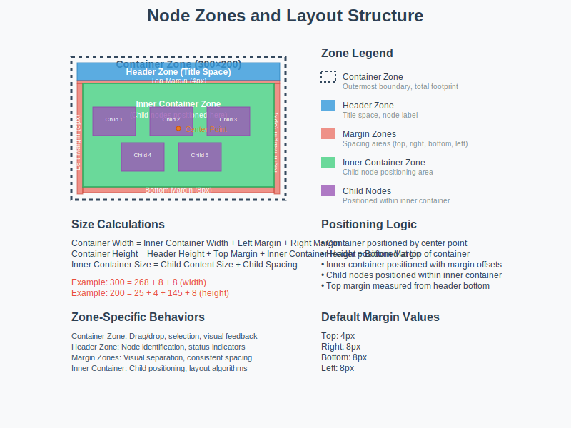

# Node System Implementation

## Overview

The node system implements a hierarchical, inheritance-based architecture for creating different types of visual nodes in the dashboard. Each node type extends base classes to inherit common functionality while providing specialized behavior and layout capabilities.

## Node Type Comparison Table

| Node Type | Category | Layout Strategy | Child Support | Auto-Sizing | Special Features | Use Case |
|-----------|----------|-----------------|---------------|-------------|------------------|----------|
| **BaseNode** | Base | Manual positioning | No | No | Foundation for all nodes | Abstract base class |
| **BaseContainerNode** | Base | Container-based | Yes | Yes | Margin management, child lifecycle | Abstract container base |
| **RectangularNode** | Basic | Fixed size | No | Text-based | Simple rectangular shape | Basic data nodes |
| **CircleNode** | Basic | Fixed size | No | Radius-based | Circular shape | Basic data nodes |
| **EdgeDemoNode** | Basic | Manual positioning | No | No | Edge connection testing | Testing and demos |
| **AdapterNode** | Specialist | Multi-arrangement | Yes | Yes | 5 layout arrangements, role modes | Data adapter patterns |
| **FoundationNode** | Specialist | Role-based | Yes | Yes | Raw/Base component layout | Data warehouse foundations |
| **MartNode** | Specialist | Role-based | Yes | Yes | Load/Report component layout | Data marts |
| **LaneNode** | Group | Vertical stacking | Yes | Yes | Single column, center alignment | Horizontal organization |
| **ColumnsNode** | Group | Horizontal row | Yes | Yes | Single row, left-to-right | Vertical organization |
| **GroupNode** | Dynamic | Bounding box | Yes | Yes | Force-directed simulation | Dynamic grouping |

### Layout Capabilities by Node Type

| Node Type | Layout Modes | Arrangements | Display Modes | Orientation Support | Margin Handling |
|-----------|--------------|--------------|---------------|-------------------|-----------------|
| **AdapterNode** | 5 modes | 5 arrangements | Full/Role | Horizontal/Vertical | Automatic |
| **FoundationNode** | 2 modes | 1 arrangement | Full/Role | 5 orientations | Automatic |
| **MartNode** | 2 modes | 1 arrangement | Full/Role | 5 orientations | Automatic |
| **LaneNode** | 1 mode | 1 arrangement | Standard | Vertical only | Automatic |
| **ColumnsNode** | 1 mode | 1 arrangement | Standard | Horizontal only | Automatic |
| **GroupNode** | 1 mode | 1 arrangement | Standard | Any | Automatic |

### Child Management Capabilities

| Node Type | Child Creation | Child Positioning | Child Sizing | Child Visibility | Edge Management |
|-----------|----------------|-------------------|--------------|------------------|-----------------|
| **BaseContainerNode** | Manual | Container-based | Automatic | Collapse/Expand | Internal edges |
| **AdapterNode** | Auto by role | Arrangement-based | Role-based | Collapse/Expand | Component edges |
| **FoundationNode** | Auto by role | Role-based | Fixed | Collapse/Expand | Component edges |
| **MartNode** | Auto by role | Role-based | Fixed | Collapse/Expand | Component edges |
| **LaneNode** | Manual | Vertical stack | Preserved | Collapse/Expand | Child edges |
| **ColumnsNode** | Manual | Horizontal row | Preserved | Collapse/Expand | Child edges |
| **GroupNode** | Manual | Bounding box | Preserved | Collapse/Expand | Simulation edges |

## Collapse and Expand System

### Overview

The collapse and expand system allows container nodes to hide or show their child nodes, providing a way to manage visual complexity and focus on specific areas of the dashboard.

### Collapse Behavior

**What Happens During Collapse:**
- Child nodes become invisible but remain in memory
- Container size reduces to minimum size (typically just enough for the label)
- Child edges are hidden
- Container visual state changes (different styling, zoom button changes to plus)
- Expanded size is stored for later restoration

**Collapse Triggers:**
- User interaction (clicking zoom button)
- Programmatic collapse via API
- Automatic collapse based on status changes (configurable)
- Parent container collapse (cascading)

**Collapse Constraints:**
- Container must meet minimum size requirements
- Parent containers must be expanded first
- Cannot collapse if parent is collapsed

### Expand Behavior

**What Happens During Expand:**
- Child nodes become visible
- Container size restores to previously stored expanded size
- Child edges become visible
- Container visual state changes (zoom button changes to minus)
- Child nodes are positioned according to layout algorithm

**Expand Triggers:**
- User interaction (clicking zoom button)
- Programmatic expand via API
- Automatic expand based on status changes (configurable)
- Parent container expansion (cascading)

**Expand Constraints:**
- Parent containers must be expanded first
- Child nodes are reinitialized if needed
- Layout calculations are performed

### Visual Indicators

**Collapsed State:**
- Zoom button shows plus (+) icon
- Container has reduced opacity or different styling
- Label remains visible
- Container border may change appearance

**Expanded State:**
- Zoom button shows minus (-) icon
- Container has normal opacity and styling
- All child nodes visible
- Normal container appearance

### Performance Considerations

**Collapse Benefits:**
- Reduces DOM elements (better performance)
- Decreases visual complexity
- Faster rendering for large hierarchies
- Reduced memory usage

**Expand Considerations:**
- Child nodes may need reinitialization
- Layout calculations required
- Potential performance impact with many children
- Edge calculations needed

## Node Zones and Layout Structure



### Zone Definitions

Each node has distinct zones that define its layout structure and behavior:

#### 1. Container Zone
**Definition:** The outermost boundary of the node, defined by the container's border or shape outline.

**Characteristics:**
- Represents the total visual footprint of the node
- Contains all other zones within its boundaries
- Defines the node's position in the parent coordinate system
- Used for collision detection and spatial queries

**Visual Representation:**
- Usually a rectangular border or shape outline
- May have rounded corners or specific styling
- Represents the maximum extent of the node's content

#### 2. Header Zone (Title Space)
**Definition:** A dedicated zone at the top of the node that contains the node's label, title, and header elements.

**Characteristics:**
- Contains the node's display name or label
- Positioned at the top of the container zone
- May include additional header elements (status indicators, icons, zoom buttons)
- Has its own styling and interaction behaviors
- Serves as a distinct layout zone separate from content

**Layout Behavior:**
- Text is typically left-aligned with padding (default: 4px from left edge)
- Height is calculated based on text content with minimum height constraint (default: 10px minimum)
- Width spans the full container width minus left/right margins
- Positioned at the top of the container zone (y=0 relative to container)
- Has its own background, border, and visual styling
- Can handle text overflow and ellipsis for long labels

#### 3. Margin Zones
**Definition:** The spacing areas around the content within the container, providing visual separation and breathing room.

**Margin Components:**
- **Top Margin:** Space between header zone and content area
- **Right Margin:** Space between content and right container edge
- **Bottom Margin:** Space between content and bottom container edge
- **Left Margin:** Space between content and left container edge

**Margin Behavior:**
- Top margin is measured from the bottom of the header zone (not the container top)
- All margins are configurable via settings
- Margins are automatically applied to child content
- Margins contribute to the total container size calculation
- Margins create the boundary between header zone and inner container zone

**Default Values:**
- Top: 4 pixels
- Right: 8 pixels
- Bottom: 8 pixels
- Left: 8 pixels

#### 4. Inner Container Zone
**Definition:** The dedicated content area below the header zone and within the margin boundaries where child nodes are positioned.

**Characteristics:**
- Contains all child nodes and their content
- Positioned below the header zone with top margin separation
- Size is calculated based on child content and spacing
- Subject to layout algorithms specific to node type
- Has its own coordinate system relative to the container

**Layout Behavior:**
- Child nodes are positioned within this zone using the zone's coordinate system
- Size adapts to accommodate child content and spacing
- Spacing between children is managed within this zone
- Transform offsets account for header height and margins
- Children are positioned relative to this zone's top-left corner (not container center)

### Zone Relationships

**Hierarchical Structure:**
```
Container Zone (outermost)
├── Header Zone (top)
├── Margin Zones (surrounding)
│   ├── Top Margin (from header bottom)
│   ├── Right Margin
│   ├── Bottom Margin
│   └── Left Margin
└── Inner Container Zone (content area)
    └── Child Nodes (positioned here)
```

**Size Calculations:**
- Container Width = Inner Container Width + Left Margin + Right Margin
- Container Height = Header Height + Top Margin + Inner Container Height + Bottom Margin
- Inner Container Size = Child Content Size + Child Spacing
- Header Zone Width = Container Width - Left Margin - Right Margin
- Inner Container Width = Container Width - Left Margin - Right Margin

**Positioning Logic:**
- Container is positioned by its center point in the parent coordinate system
- Header zone is positioned at the top of the container (y=0)
- Inner container zone is positioned below the header with top margin offset
- Child nodes are positioned within the inner container using the inner container's coordinate system
- Each zone has its own coordinate system and positioning context

### Zone-Specific Behaviors

**Container Zone:**
- Handles drag and drop operations
- Manages selection state
- Provides visual feedback for interactions
- Defines the node's bounding box

**Header Zone:**
- Displays node identification and title
- May show status indicators, icons, and zoom buttons
- Handles text overflow with ellipsis
- Provides context for the node's purpose
- Has its own interaction behaviors (click, hover)
- Can be styled independently from other zones

**Margin Zones:**
- Provide visual separation
- Ensure content doesn't touch container edges
- Allow for consistent spacing across different node types
- Support responsive design considerations

**Inner Container Zone:**
- Manages child node positioning within its coordinate system
- Handles layout algorithm execution for child arrangement
- Provides coordinate system for child positioning (top-left origin)
- Manages child visibility and lifecycle
- Handles child addition, removal, and repositioning
- Adapts size based on child content and layout requirements

### Configuration and Customization

**Zone Sizing:**
- Margins can be customized per node type
- Header height can be adjusted based on content
- Inner container size is calculated automatically
- Container size adapts to content requirements

**Zone Styling:**
- Each zone can have different visual styling
- Borders, backgrounds, and effects can be applied
- Responsive design considerations for different screen sizes
- Accessibility considerations for zone identification

**Zone Interactions:**
- Different zones can have different interaction behaviors
- Click areas can be zone-specific
- Hover effects can target specific zones
- Drag and drop can be restricted to certain zones

---

## Implementation Requirements

### Zone-Based Architecture

**Zone Abstraction:**
- Each zone should be implemented as a separate class or module
- Zones should have a common interface for positioning, sizing, and styling
- Zone relationships should be managed through a zone manager
- Each zone should handle its own rendering and interaction logic

**Zone Manager:**
- Central coordinator for all zones within a node
- Manages zone creation, positioning, and lifecycle
- Handles zone-to-zone communication and dependencies
- Provides unified interface for zone operations

### Header Zone Implementation

**Header Zone Class:**
- Dedicated class for header zone functionality
- Handles text rendering, overflow, and styling
- Manages header-specific interactions (click, hover)
- Supports configurable height and padding
- Handles status indicators, icons, and zoom buttons

**Header Zone Features:**
- Text-based height calculation with minimum height constraint (default: 10px minimum)
- Text overflow handling with ellipsis
- Left-aligned text with configurable padding
- Background and border styling
- Interaction event handling
- Status indicator integration

### Inner Container Zone Implementation

**Inner Container Zone Class:**
- Dedicated class for inner container functionality
- Manages child node positioning and lifecycle
- Handles layout algorithm execution
- Provides coordinate system for child positioning
- Manages child addition, removal, and updates

**Inner Container Features:**
- Top-left origin coordinate system
- Child positioning relative to zone boundaries
- Layout algorithm integration
- Size calculation based on child content
- Transform management for positioning
- Child lifecycle management

### Margin System Implementation

**Margin Manager:**
- Centralized margin calculation and application
- Handles margin configuration and validation
- Provides margin-aware positioning utilities
- Manages margin relationships between zones

**Margin Features:**
- Configurable margins (top, right, bottom, left)
- Margin validation and constraints
- Margin-aware zone positioning
- Dynamic margin adjustment

### Coordinate System Management

**Zone Coordinate Systems:**
- Each zone has its own coordinate system
- Coordinate transformations between zones
- Parent-child coordinate relationships
- Transform chain management

**Positioning Utilities:**
- Zone-relative positioning calculations
- Transform offset calculations
- Coordinate system conversion utilities
- Position validation and constraints

### Configuration System

**Zone Configuration:**
- Configurable zone dimensions and properties
- Zone-specific styling and behavior settings
- Default value management
- Configuration validation and constraints

**Settings Management:**
- Centralized settings for all zones
- Default value provision
- Configuration merging and validation
- Settings inheritance and override

### Event System

**Zone Event Management:**
- Zone-specific event handling
- Event propagation between zones
- Zone interaction coordination
- Event delegation and bubbling

**Interaction Coordination:**
- Zone-specific click and hover areas
- Drag and drop zone restrictions
- Zone interaction state management
- Cross-zone interaction handling

### Rendering System

**Zone Rendering:**
- Each zone handles its own rendering
- Zone-specific visual elements
- Styling and theming support
- Rendering optimization and caching

**Visual Management:**
- Zone-specific styling and theming
- Visual state management (hover, selected, etc.)
- Rendering performance optimization
- Visual feedback and animations

### Performance Considerations

**Zone Optimization:**
- Lazy zone initialization
- Zone-specific rendering optimization
- Memory management for zone instances
- Performance monitoring and profiling

**Efficient Operations:**
- Batch zone operations
- Zone update batching
- Efficient coordinate calculations
- Minimal DOM manipulation

### Testing and Validation

**Zone Testing:**
- Unit tests for each zone class
- Zone interaction testing
- Coordinate system validation
- Performance testing

**Integration Testing:**
- Zone-to-zone interaction testing
- Complete node functionality testing
- Layout algorithm validation
- Edge case handling

---

## Child Positioning System

### Overview

The child positioning system determines how child nodes are arranged within the inner container zone of their parent node. Each node type implements specific positioning algorithms that define the spatial relationships between parent and child nodes.

### Positioning Coordinate System

**Parent-Child Coordinate Relationship:**
- Child nodes are positioned relative to their parent's inner container zone
- The parent's center point serves as the origin for child positioning calculations
- Child positions are calculated in the parent's coordinate space
- Transform offsets are applied to account for container margins and positioning

**Coordinate Transformation:**
- Parent container applies a transform offset to the inner container
- Child nodes receive their positions within this transformed coordinate system
- The transform accounts for margin offsets and container positioning
- Children inherit the parent's coordinate space for their own positioning

### Positioning Algorithms by Node Type

#### Container-Based Positioning (BaseContainerNode)

**Transform Application:**
- Container transform: `translate(containerMargin.left - containerMargin.right, containerMargin.top - containerMargin.bottom)`
- This offset ensures children are positioned within the margin boundaries
- Children receive positions relative to the transformed container center

**Child Position Calculation:**
- Children are positioned relative to the container's center point
- X and Y coordinates are calculated from the container center
- Margin offsets are automatically applied through the container transform
- Child positions are updated when container size changes

#### Vertical Stacking (LaneNode)

**Layout Algorithm:**
- Children are arranged in a single vertical column
- Each child is positioned below the previous child
- Vertical spacing is applied between children using `nodeSpacing.vertical`
- Children are centered horizontally within the container

**Position Calculation:**
- Starting Y position: Container top + top margin
- Each child's Y position: Previous child's bottom + spacing
- X position: Container center (children are centered horizontally)
- Container height expands to accommodate all children plus spacing

**Spacing Management:**
- Vertical spacing between children: `nodeSpacing.vertical` (default: 10px)
- No spacing before the first child
- Spacing applied between each pair of children
- Total spacing = (number of children - 1) × vertical spacing

#### Horizontal Row (ColumnsNode)

**Layout Algorithm:**
- Children are arranged in a single horizontal row
- Each child is positioned to the right of the previous child
- Horizontal spacing is applied between children using `nodeSpacing.horizontal`
- Children are aligned vertically within the container

**Position Calculation:**
- Starting X position: Container left + left margin
- Each child's X position: Previous child's right + spacing
- Y position: Container center (children are aligned vertically)
- Container width expands to accommodate all children plus spacing

**Spacing Management:**
- Horizontal spacing between children: `nodeSpacing.horizontal` (default: 20px)
- No spacing before the first child
- Spacing applied between each pair of children
- Total spacing = (number of children - 1) × horizontal spacing

#### Bounding Box (GroupNode)

**Layout Algorithm:**
- Children maintain their relative positions within the container
- Container size is calculated based on the bounding box of all children
- Children are positioned relative to the container's coordinate system
- Container adapts to fit all children with appropriate margins

**Position Calculation:**
- Bounding box is calculated from all child positions and sizes
- Container size = bounding box + margins
- Children are repositioned relative to the new container center
- Original child-to-child relationships are preserved

**Dynamic Positioning:**
- Supports force-directed simulation for child positioning
- Children can be positioned by external algorithms (e.g., D3 force simulation)
- Container adapts to child position changes
- Real-time updates when child positions change

#### Role-Based Positioning (AdapterNode, FoundationNode, MartNode)

**Component Positioning:**
- Child nodes are created based on predefined roles (staging, transform, archive, etc.)
- Each role has a specific position within the layout arrangement
- Positions are calculated based on the selected arrangement mode
- Component sizes may be adjusted to fit the layout

**Arrangement-Based Layout:**
- Different arrangement modes define different positioning patterns
- Components are positioned according to the arrangement algorithm
- Spacing between components follows `nodeSpacing` settings
- Container size adapts to the arrangement requirements

**Role-Specific Positioning:**
- Each role (staging, transform, archive, etc.) has predefined positions
- Positions are calculated relative to other components in the arrangement
- Component order and relationships are maintained
- Layout adapts when components are added or removed

### Positioning Triggers and Updates

#### Automatic Positioning Updates

**Container Size Changes:**
- When container size changes, child positions are recalculated
- Children are repositioned to maintain their relative positions
- Spacing and margins are preserved during resizing
- Layout algorithms are re-executed to ensure proper positioning

**Child Addition/Removal:**
- When children are added, positions are recalculated for all children
- When children are removed, remaining children are repositioned
- Container size is adjusted to accommodate the new child count
- Spacing is redistributed among remaining children

**Layout Mode Changes:**
- When layout mode changes, all child positions are recalculated
- Children are repositioned according to the new layout algorithm
- Container size may change to accommodate the new layout
- Child relationships may be redefined based on the new mode

#### Manual Positioning Updates

**Programmatic Position Changes:**
- Child positions can be updated programmatically
- Position changes trigger container size recalculation
- Layout algorithms may be re-executed depending on the change
- Parent containers are notified of child position changes

**Drag and Drop Positioning:**
- Children can be repositioned through drag and drop
- Position changes are validated against layout constraints
- Container size and other children may be affected
- Layout algorithms may be re-executed to maintain consistency

### Positioning Constraints and Validation

#### Size Constraints

**Minimum Size Requirements:**
- Children must meet minimum size requirements
- Container size cannot be smaller than the sum of child minimum sizes
- Layout algorithms respect minimum size constraints
- Children may be resized to meet layout requirements

**Maximum Size Limitations:**
- Container size may have maximum limits
- Children may be constrained by available space
- Layout algorithms may compress or expand children to fit
- Overflow handling may be implemented for large child sets

#### Position Constraints

**Boundary Constraints:**
- Children must remain within the container boundaries
- Margin requirements must be respected
- Children cannot overlap container edges
- Position validation ensures children stay within bounds

**Spacing Constraints:**
- Minimum spacing between children must be maintained
- Spacing cannot be negative
- Layout algorithms respect spacing constraints
- Spacing may be adjusted to accommodate all children

### Performance Considerations

#### Positioning Optimization

**Batch Updates:**
- Multiple position changes are batched together
- Layout calculations are performed once per batch
- Display updates are suspended during batch operations
- Single display change notification at the end of batch

**Lazy Positioning:**
- Child positions are calculated only when needed
- Invisible children may not be positioned
- Collapsed containers skip child positioning
- Position calculations are deferred until expansion

**Efficient Algorithms:**
- Layout algorithms are optimized for common cases
- Position calculations use efficient mathematical operations
- Bounding box calculations are cached where possible
- Transform operations are minimized

#### Memory Management

**Position Caching:**
- Child positions may be cached to avoid recalculation
- Position cache is invalidated when dependencies change
- Cache size is limited to prevent memory issues
- Cached positions are cleared when children are removed

**Reference Management:**
- Child references are managed efficiently
- Position calculations avoid unnecessary object creation
- Transform objects are reused where possible
- Memory usage is optimized for large child sets 