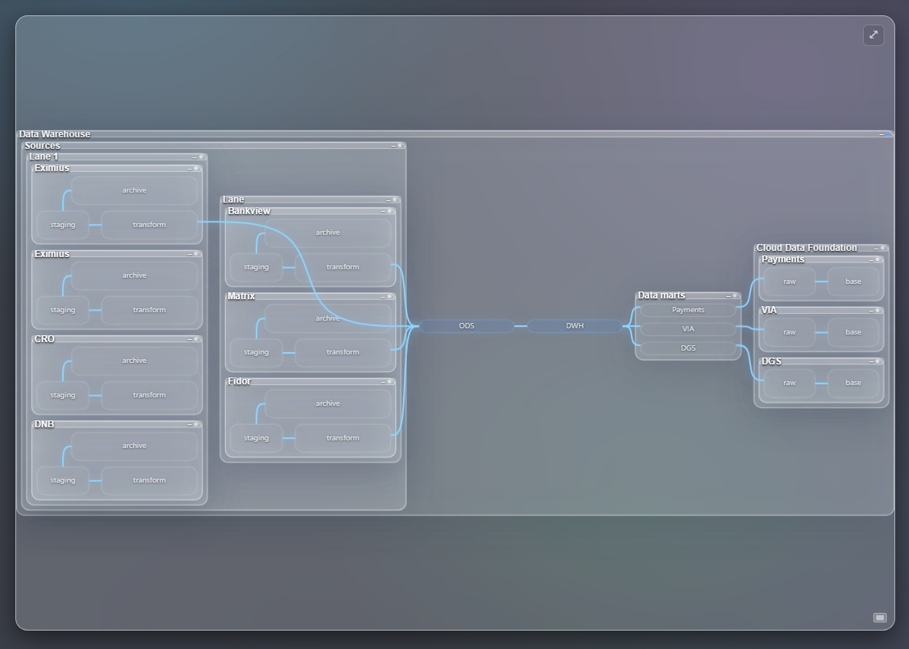
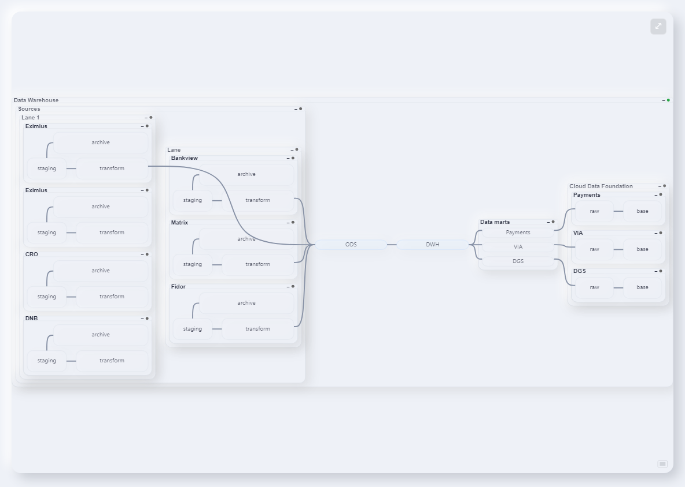

# 🎨 FlowDash Themes

A comprehensive collection of visual themes for the FlowDash dashboard system. Each theme offers a unique aesthetic and user experience while maintaining functionality and accessibility.

> 💡 **Tip**: This page looks best with the included [themes.css](./themes.css) stylesheet for enhanced visual presentation.

---

## 🌟 Featured Themes

### Light Theme

**Clean & Professional** - Pure white backgrounds with subtle gray surfaces for maximum readability and a corporate-friendly appearance. Perfect for business environments and presentations.

[View Details →](./light/style.md) | [CSS File](./light/flowdash.css)

---

### Dark Theme

**Low-Glare & Modern** - Deep backgrounds with crisp, legible text and cool accents. Reduces eye strain while maintaining high contrast and readability.

[View Details →](./dark/style.md) | [CSS File](./dark/flowdash.css)

---

### Brutalism Theme

**Bold & Functional** - Loud, opinionated design with thick borders, bright fills, and zero ambiguity. Every element exists to communicate hierarchy clearly.

[View Details →](./brutalism/style.md) | [CSS File](./brutalism/flowdash.css)

---

### Cyberpunk Theme

**Neon & Noir** - Dark techno base with saturated neon accents that glow. Features holographic motion and electric aesthetics for a futuristic feel.

[View Details →](./cyberpunk/style.md) | [CSS File](./cyberpunk/flowdash.css)

---

### Flat Theme

**Minimal & Modern** - Clean, flat design with bold colors and sharp edges. Emphasizes content over decoration for a streamlined experience.

[View Details →](./flat/style.md) | [CSS File](./flat/flowdash.css)

---

### Glassmorphism Theme

**Translucent & Elegant** - Modern glass-like effects with subtle transparency, blur effects, and layered depth for a sophisticated appearance.

[View Details →](./glassmorphism/style.md) | [CSS File](./glassmorphism/flowdash.css)

---

### Neumorphism Theme

**Soft & Tactile** - Soft shadows and highlights that create the illusion of extruded or inset elements, providing a tactile, physical feel.

[View Details →](./neumorphism/style.md) | [CSS File](./neumorphism/flowdash.css)

---

### Retro Theme

**Vintage & Nostalgic** - Inspired by classic computing and design eras, featuring warm colors, retro typography, and nostalgic visual elements.

[View Details →](./retro/style.md) | [CSS File](./retro/flowdash.css)

---

 

## 🚀 Quick Start

1. **Choose a theme** from the collection above
2. **View the documentation** to understand the design principles
3. **Copy the CSS file** to your project
4. **Apply the theme** by including the CSS and setting the appropriate data attribute

## 📁 File Structure

Each theme folder contains:
- `flowdash.css` - The main theme stylesheet
- `style.md` - Detailed design documentation and guidance
- `*-preview.png` - Visual preview image (when available)

## 🎯 Theme Selection Guide

| Use Case | Recommended Themes |
|----------|-------------------|
| **Business/Corporate** | Light, Dark, Flat |
| **Creative/Design** | Glassmorphism, Neumorphism |
| **Technical/Developer** | Brutalism, Cyberpunk |
| **Modern/Minimal** | Light, Flat, Dark |
| **Experimental** | Alt, Retro |

## 🔧 Customization

All themes use CSS custom properties (variables) for easy customization. Modify the `:root` variables in any theme's CSS file to create your own variations.

---

*Need help choosing? Start with the Light theme for maximum compatibility, or Dark theme for reduced eye strain.*

## Container state styling guidelines

These rules standardize how container nodes visually respond to states across themes. They ensure clarity while keeping the UI calm and readable.

- **Collapsed containers: reflect state fully**
  - Treat collapsed containers like rect nodes: full, clear state colors; no animations needed beyond the base.
  - Example (using status on the ancestor container group):
```css
.collapsed[status="Ready"] .container-shape { fill-opacity: 1; }
.collapsed[status="Updated"] .container-shape { fill-opacity: 1; stroke: none; }
.collapsed[status="Updating"] .container-shape { animation: none; stroke-dasharray: none; }
```

- **Expanded adapters, marts, foundations: subdued state styling**
  - Use toned-down fills (reduced opacity), neutral strokes, and **no animations**.
  - Match each theme’s aesthetic but keep containers visually quieter than base nodes.
```css
.expanded[status="Ready"] .container-shape { fill-opacity: 0.2–0.3; }
.expanded[status="Updating"] .container-shape { animation: none; stroke-dasharray: none; }
```

- **Expanded lanes and columns: no state styling**
  - Do not apply state-based fills or animations. Show only the default container styling from the theme; the status icon communicates state.
```css
.lane.expanded .container-shape,
.columns.expanded .container-shape {
  fill: none;
  fill-opacity: 0;
  animation: none;
  stroke-dasharray: none;
}
```

### Implementation notes

- **Where state lives**: The `status` attribute is applied to the container `<g>` element, not the `rect`. Use ancestor selectors:
```css
.expanded[status="Warning"] .container-shape { /* ... */ }
.collapsed[status="Updated"] .container-shape { /* ... */ }
```
- **Specificity**: Place lane/columns overrides after generic container rules so they take precedence.
- **Status icon**: Header status indicators remain the primary signal for lanes/columns when expanded.
- **Accessibility**: Ensure sufficient contrast for strokes and avoid flashing animations on large surfaces.

### Example container markup
```html
<g class="Adapter expanded" id="1282" status="Warning" transform="translate(0,-80)">
  <g class="zone-container">
    <rect class="container-shape" x="-98" y="-35" width="196" height="70"></rect>
  </g>
  <!-- header, inner zones, etc. -->
</g>
```